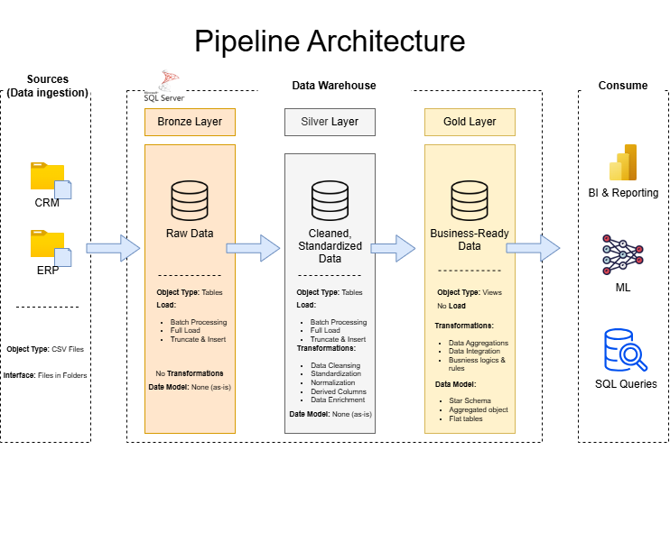

# 🏗️ Data Warehouse and Analytics Project

> Developing scalable SQL Server data warehousing solutions, encompassing automated ETL workflows, robust data modeling, and actionable business intelligence.

[](LICENSE)
[](#)

---

## 📋 Table of Contents

- [Overview](#overview)
- [Architecture](#architecture)
- [Project Structure](#project-structure)
- [Getting Started](#getting-started)
- [License](#license)
- [Contact](#contact)

---

## 📌 Overview

This project involves:

- **Data Architecture**: Designing a Modern Data Warehouse Using Medallion Architecture Bronze, Silver, and Gold layers.

- **ETL Pipelines**: Extracting, transforming, and loading data from source systems into the warehouse.

- **Data Modeling**: Developing fact and dimension tables optimized for analytical queries.

- **Analytics & Reporting**: Creating SQL-based reports and dashboards for actionable insights.

---

## 🏛️ Architecture

The data architecture for this project | Medallion Architecture (Bronze, Silver, Gold) Layers




1. Bronze Layer: Stores raw data as-is from the source systems. Data is ingested from CSV Files into SQL Server Database.

2. Silver Layer: This layer includes data cleansing, standardization, and normalization processes to prepare data for analysis.

3. Gold Layer: Houses business-ready data modeled into a star schema required for reporting and analytics.

---

## 📁 Project Structure

```
your-project/
├── datasets/                             # Raw Data
│   ├── source_crm/
│   │   ├── cust_info.csv
│   │   ├── prd_info.csv
│   │   └── sales_details.csv
│   └── source_erp/
│       ├── CUST_AZ12.csv
│       ├── LOC_A101.csv
│       └── PX_CAT_G1V2.csv
├── docs/                                 # Documents
│   ├── models/
│   └── architecture_diagram.drawio.png
├── scripts/                              # SQL Scripts
│   ├── bronze/
│   │   ├── ddl_bronze.sql
│   │   └── proc_load_bronze.sql
|   ├── silver/
│   │   ├── ddl_silver.sql
│   │   └── proc_load_silver.sql
|   ├── gold/
│   │   └── ddl_gold.sql
│   └── init_database.sql
├── LICENSE
└── README.md
```

---

## 🚀 Getting Started

### Prerequisites

- SQL Server Express: Lightweight server for hosting your SQL database.
- SQL Server Management Studio (SSMS): GUI for managing and interacting with databases.Python 3.11+


## 📄 License

This project is licensed under the **MIT License** — see the [LICENSE](LICENSE) file for details.

---

## 📬 Contact

|                  | Contact                              |
|------------------|--------------------------------------|
| LinkedIn         | [Abanob Melk](https://www.linkedin.com/in/abanob-melk/) |
| Email            | AbanobAshraf220@gmail.com            |

---

<p align="center">
  Built with ❤️ by Abanob Ashraf
</p>
